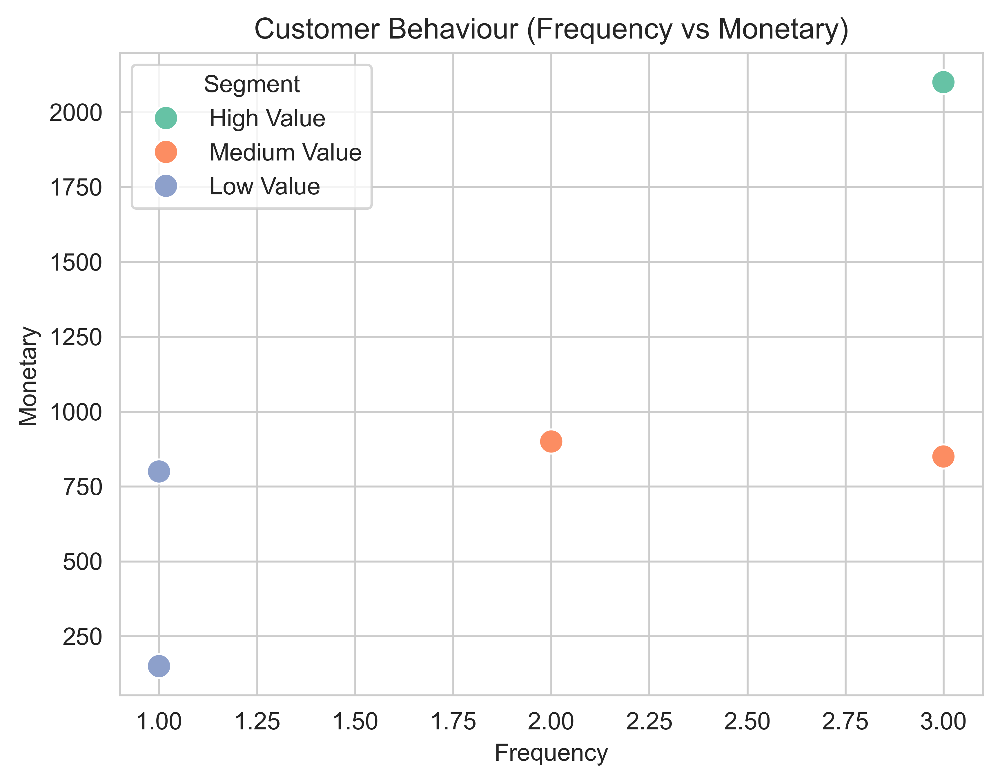
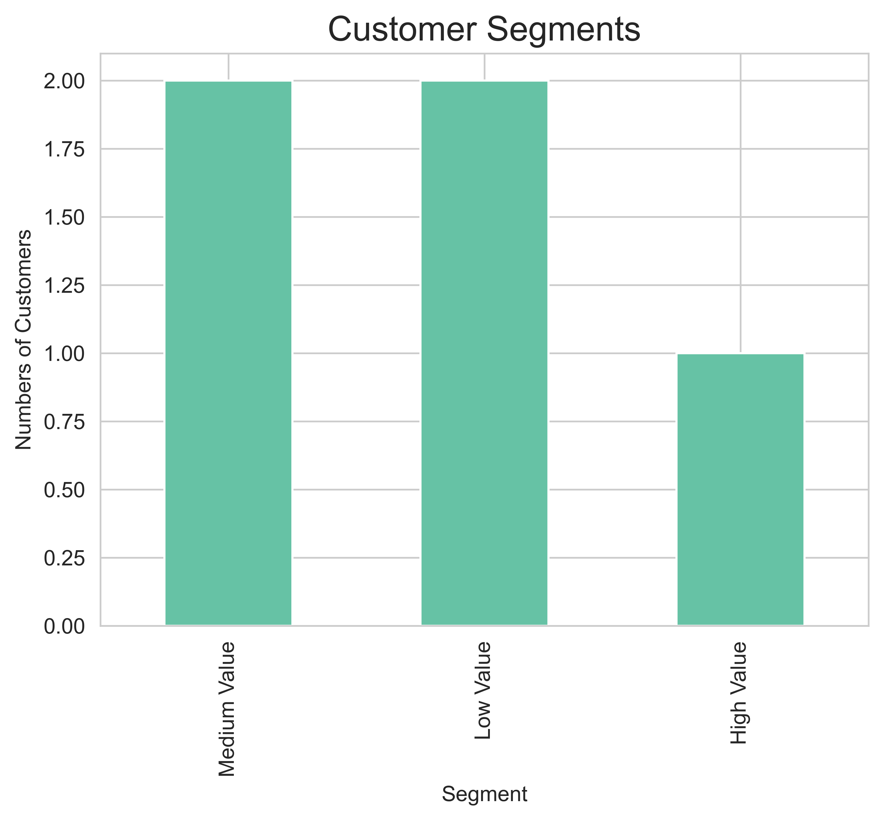

📊 Customer Segmentation using RFM Analysis

This project performs customer segmentation using the RFM (Recency, Frequency, Monetary) model to analyze customer behavior and identify valuable customers.

---

🚀 Objective

To classify customers into different segments (High, Medium, Low value) based on their purchasing patterns and provide actionable business insights.

---

📂 Dataset

The dataset includes:

- CustomerID
- Date of purchase
- Transaction amount

---

🧠 RFM Explanation

- Recency → How recently a customer made a purchase
- Frequency → How often a customer purchases
- Monetary → How much money a customer spends

---

⚙️ Features

- Data cleaning and preprocessing
- RFM metric calculation using Pandas
- Customer segmentation logic
- Bar chart visualization (Customer Segments)
- Scatter plot visualization (Customer Behavior)

---

📊 Visualizations

🔹 Customer Segments

"Segments" (segments.png)

🔹 Customer Behavior (Frequency vs Monetary)

"Behavior" (customer_behavior.png)

---
## 📊 Dashboard Preview

🛠️ Tools & Technologies

- Python
- Pandas
- Matplotlib
- Seaborn

---

💼 Business Use Case

This project helps businesses:

- Identify high-value customers
- Improve customer retention
- Make data-driven decisions
- Increase overall revenue

---

👨‍💻 Author

Vikram Prajapati
